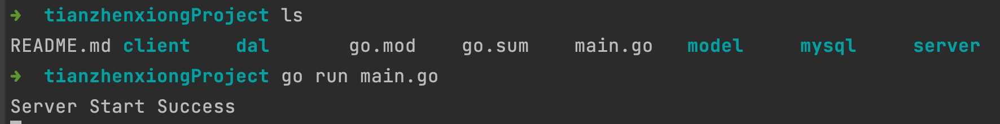
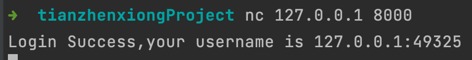
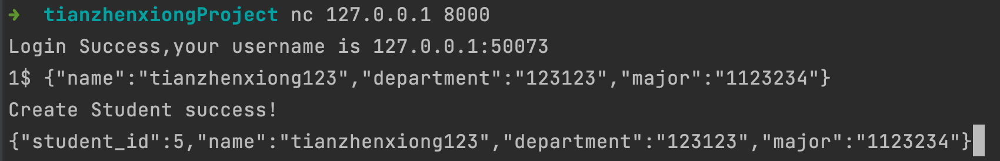
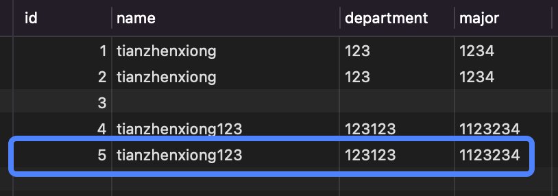
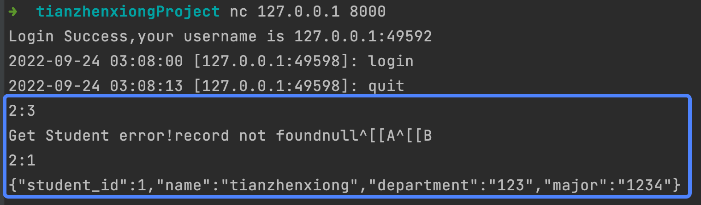
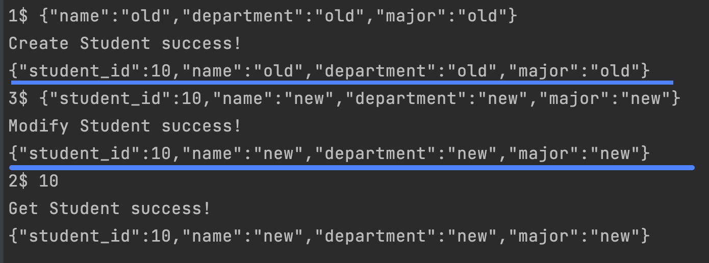
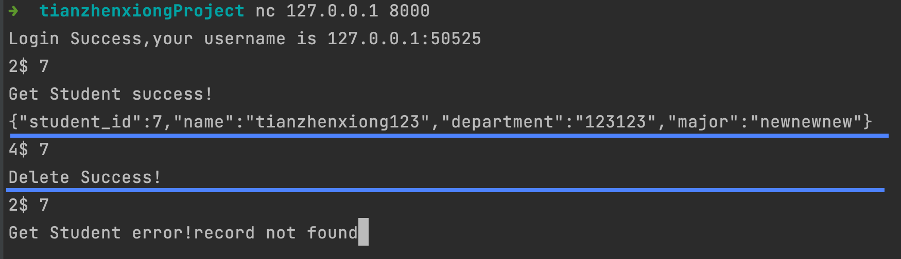
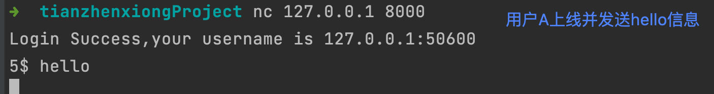
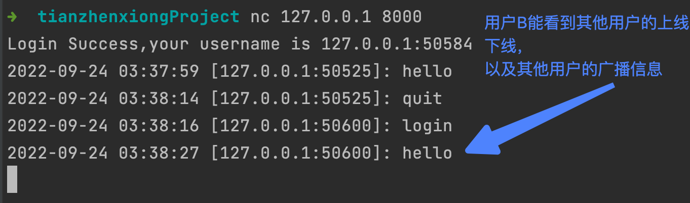
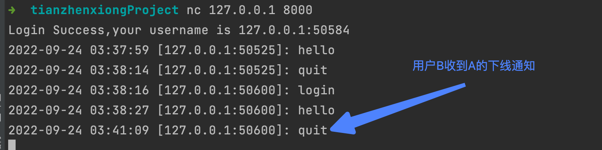

因为时间较为紧迫，本次demo我选择了使用golang语言来进行开发。因为本次demo的编写TCP服务器与操作数据库两个核心功能，golang都有较好的框架支持（原生的网络库，以及字节跳动开源的[gorm](https://gorm.io/zh_CN/docs/index.html)）。其次golang语言的底层对并发的良好支持与高性能也很吸引我。

## 需求背景

本系统需要实现：

1. 用户的上线、下线
2. 用户对学生信息的增删改查
3. 在线用户的聊天功能（一个简易的公共聊天室）


## 部署运行说明

请按照顺序执行

### 1. 准备数据库

需要再本地3306端口开启MySQL服务，并将用户名&&密码与代码中的数据库连接配置对应，并在MySQL中建立好对应的数据库。（空的数据库即可，**无需建表**）

```mysql
CREATE DATABASE IF NOT EXISTS TzxDemo;
```

```go
//代码块中的MySQL配置信息，路径为./mysql/mysql.go 
func Default() {
	temp := &Mysql{}
	dsn := "root:root123456@tcp(127.0.0.1:3306)/TzxDemo?charset=utf8mb4&parseTime=True&loc=Local"
  //格式："${mysql用户名}:${mysql密码}@tcp${ip:port}/${数据库名}?charset=utf8mb4&parseTime=True&loc=Local"
	conn, err := gorm.Open(mysql.Open(dsn), &gorm.Config{})
	//.....
}
```

### 2. server端启动

**需先配置好golang1.18的环境**

```shell
//项目根目录下
go mod tidy //下载，更新依赖
go run main.go
```

出现`Server Start Success`字样即为服务启动成功



### 3. client端

因时间紧急，没有编写client端代码，直接使用的linux的nc命令进行tcp链接模拟客户端。

```shell
nc 127.0.0.1 8000
```

出现`Login Success,your username is IP:PORT`字样即为连接服务成功



用户上线、下线，均会向当前所有在线用户广播通知。


## 使用说明

在client端中可输入如下命令（格式：`operation$ message`）

1. `1$ {"name":"tianzhenxiong123","department":"123123","major":"1123234"} `可以创建学生信息，其中主键为自增。
   1. 
   2. 
2. `2$ #{studentID}`可以进行学生信息的查询，返回错误信息 or json文本。
   1. 

3. `3$ #{json}`可以进行更新学生信息，依靠主键studentid。
   1. 

4. `4$ #{studentID}`可以进行学生信息的删除。
   1. 
5. `5$ #{message}`可以进行消息的广播。
   1. 
   2. 

6. `6$ quit`可以退出登录
   1. 
   2. 


## 实现原理

使用golang自带的net包处理tcp连接请求

使用golang的协程机制实现并发

使用gorm操作MySQL数据库


## 反思与不足

1. 时间紧张，没有详细的分析思考系统的设计，只是用偏面向过程的思路完成了要求的功能。对于通讯的协议结构没有很好的设计，笼统的使用了字符串，如果后期需要增加功能可能会遇到问题。
2. 只是象征性的写了些单元测试，并不全，有些代码没被单元测试覆盖。
3. 没有经过全面的测试，压力测试。后续可以通过压力测试找到能够优化的点进行性能上的优化。
